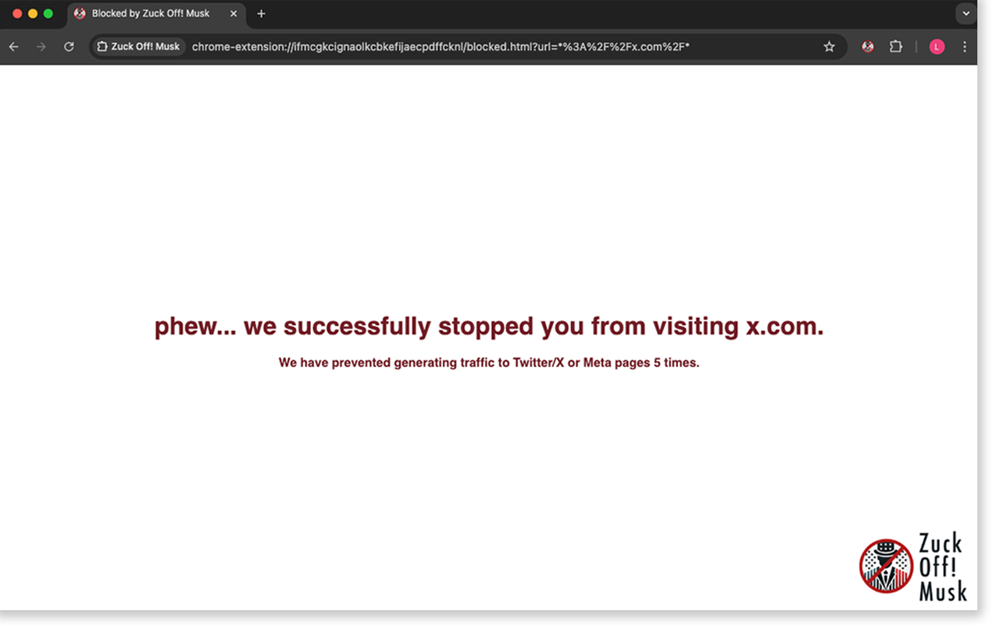

**Blocks all traffic to Musks Twitter/X and Zuckerbergs meta sites.**

## What / Why?
Some Reddit subs start to ban links to Twitter/X.
I really like the idea to reduce traffic to Musks and Zucks platforms.
This extension helps in case you missclick a link.

## How?
It checks if a site you’re about to visit matches a specific pattern and rewrites the URL to redirect you to the blocking page.
No data is sent to any server.

## Installation

### load in dev-mode
1. Clone the repository or download the ZIP file.
2. Open Chrome and navigate to `chrome://extensions/`.
3. Enable "Developer mode" by toggling the switch in the top right corner.
4. Click "Load unpacked" and select the directory containing the extension files.
